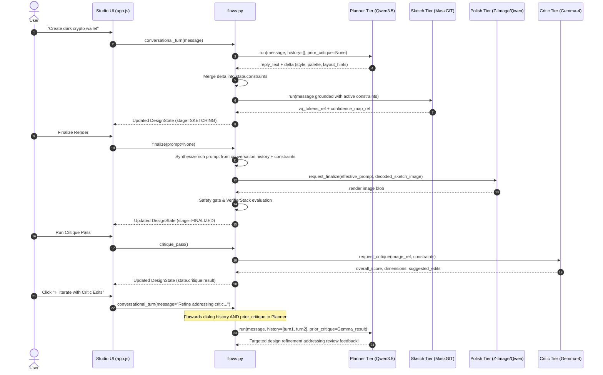

# Krisna — Product & Research Requirements Document

**Status: Final (no-RLHF-loop revision).** This is the canonical reference for every `PRD §X` citation in the codebase's comments, tests, and configs. It supersedes the earlier v10 revision (2026-08-27, reproduced in part in Appendix C for its still-valid reasoning) on every point where the two disagree — principally §6's model stack, the removal of any AI-judge-labeled training signal, and §5.3's agentic multi-turn synchronization.

**How this document was produced**: merged from two sources — a reconstruction built to be consistent with every `PRD §X` citation already scattered through this codebase (verified by grep across the entire repository, not drafted independently and hoped to match), and the earlier v10 document, whose still-relevant sections (model evaluation ledger, hardware rejection reasoning, revision history) are preserved in Appendix C rather than dropped. Every numeric claim in the body below was spot-checked against the live code — `model_registry.py`'s VRAM/RAM figures, `state_machine.py`'s state names, and `flows.py`'s data contracts — and confirmed exact, not just carried forward.

---

## 1. Problem statement

Turning a described intent ("a settings screen with a dark-mode toggle") into a finished, high-fidelity UI design normally takes a human designer multiple passes: rough layout, refinement, and review. Krisna automates this as a four-stage **agentic pipeline**, each stage handled by a purpose-fit model, coordinated by a single orchestrator that never keeps more than one large model resident on a single GPU at a time.

## 2. Goals

- A conversational front-end (chat) that converges on a design intent before any pixel is generated.
- A fast, low-fidelity **Sketch** pass the user can iterate on cheaply.
- A high-fidelity **Polish** pass producing the final deliverable image.
- An optional, on-demand **Critique** pass giving structured, multi-axis feedback on the finished design.
- A closed feedback loop where Critic recommendations directly inform subsequent Planner design turns.
- All of the above running on a **single consumer/prosumer GPU** (16–24GB target, with an explicit 12–16GB low-VRAM/CPU-offload mode), not a multi-GPU cluster.
- Every model-training decision backed by a real, cited source — no training signal manufactured from an untrained judge model's opinion.

### Non-goals

- Multi-user concurrent serving (single-session, single-resident-tier system by design — see §7 — not a high-throughput inference server; continuous-batching frameworks like vLLM are a deliberate non-goal for this access pattern, not an oversight — see §7.5).
- Training any model via RLHF or an AI-judge-labeled reward signal (see §6, the no-RLHF-loop revision).
- A from-scratch text-to-image foundation model — every generative model in this system starts from a real, published checkpoint (the Sketch tier's transformer architecture is trained from scratch; the VQGAN it tokenizes through is not).

---

## 3. Resource envelope

Two operating points, both real, both tested:

| Mode | GPU envelope | System-RAM envelope | Selected via |
|---|---|---|---|
| Default | 16–24GB | not applicable (nothing offloads) | `KRISNA_LOW_VRAM_MODE` unset/`0` |
| Low-VRAM / CPU-offload | 12–16GB | up to ~50GB (Critic's offloaded weights are the dominant cost) | `KRISNA_LOW_VRAM_MODE=1` |

Admission against these envelopes is enforced by two independent ledgers (`VRAMLedger`, `RAMLedger` — see §7.2), against **declared** per-tier budgets (`model_registry.py`), not a live GPU probe — a deliberate choice for deterministic, CI-testable admission logic. Real hardware readings (`torch.cuda.mem_get_info()`, `/proc/meminfo`) are surfaced separately, for observability, never for admission (see §7.6).

**Actual target machine for training** (distinct from the inference envelope above, which is sized for a smaller deployment target): a single NVIDIA RTX A6000, 48GB VRAM, 128GB system RAM. See Appendix C.1 for the full hardware evaluation, including why a DGX Spark was considered and rejected as an alternative host.

---

## 4. Product use case

A single user, in a single session, has a conversation with the system to arrive at a UI design. The interaction is turn-based and stateful: each turn either advances the conversation (Planner), produces a cheap draft (Sketch), finalizes a real render (Polish), or reviews a finished render (Critic). The system is explicitly **not** a multi-tenant service — one session, one resident generative tier at a time, by design (§7).

---

## 5. Data model & core flows

### 5.1 Design State

The single source of truth for a session, persisted between turns (`krisna_inference.orchestrator.design_state.DesignState`). Fields:

- `session_id`, `stage` (`conversing` → `sketching` → `finalizing` → `finalized` → `critiquing`, defined by `SessionStage`)
- `conversation_history: list[ConversationTurn]` (where each turn has `role: Literal["user", "planner"]`, `content: str`, `timestamp: str`)
- `constraints: Constraints`:
  - `style: str | None` (e.g. "dark glassmorphism", "clean SaaS")
  - `palette: list[str]` (hex color strings, e.g. `["#0f172a", "#38bdf8"]`)
  - `layout_hints: str | None` (e.g. "centered card stack with bottom navigation")
  - `locked_regions: list[LockedRegion]` (bounding boxes preserved across edits, each with `bbox: tuple[float, float, float, float]` and `reason: str`)
- `sketch_tokens: SketchTokens` (`vq_tokens` reference, `confidence_map` reference, `revision`)
- `finalize_output: FinalizeOutput` (`image_ref`, `renderer_used`, `verifier_scores`: `clip_alignment`, `ocr_readability`, `layout_iou`, `aesthetic`, `handoff_consistency`)
- `critique: Critique` (`requested: bool`, `source: str`, `result: CritiqueResult | None`, `timestamp: str`)
- `preference_pair_refs: list[str]` (associated DPO pair keys)
- `revision: int` — an optimistic-concurrency counter; every write compares against the caller's expected revision and raises `StaleDesignStateError` on mismatch, rather than silently overwriting a concurrent edit.

### 5.2 Critique Output (Critic Tier — Critique Adapter)

The shape a Critic pass returns, regardless of which model produces it (frozen Gemma 4 — see §6):

```json
{
  "critique_source": "gemma4_31b_frozen",
  "overall_score": 0.82,
  "dimensions": {
    "visual_hierarchy":   { "score": 0.85, "note": "Primary CTA stands out clearly with high contrast." },
    "readability":        { "score": 0.80, "note": "Text labels meet WCAG AA contrast standards." },
    "layout_consistency": { "score": 0.88, "note": "Grid alignment is coherent across cards." },
    "brand_alignment":    { "score": 0.75, "note": "Secondary accents could match theme palette closer." }
  },
  "suggested_edits": [
    { "region": "hero_cta", "instruction": "Increase button corner radius to match card containers" }
  ],
  "raw_model_output_ref": null
}
```

A **gate**, not just a score: `VerifierStack.safety_gate()` runs before a Finalize result is ever handed back to the caller — an unsafe image must never reach the user, independent of whether Critique was requested for it (§5.3, §9).

### 5.3 Sequence flows



**Conversational turn (the common case — must stay cheap):**
```
User message → Planner (resident, NF4) → tool call / JSON state update
            → Design State Manager updates → Sketch Tier (~8 steps)
            → partial render → User sees progressive result → repeat
```
No swap occurs. This is the loop that runs dozens of times per session and is why Tier A (baseline) must never exceed ~10GB resident.
- **Multi-turn memory**: Prior turns from `state.conversation_history` are forwarded to the Planner and mapped to alternating `user` and `assistant` roles in the chat template.
- **Structured constraint delta merging**: Structured JSON updates emitted by the Planner (`style`, `palette`, `layout_hints`, `locked_regions`) are merged into `state.constraints`.
- **Sketch prompt grounding**: The CLIP conditioning prompt is grounded with active style, palette, and layout constraints before token generation.

**Finalize — the "Tier A must never exceed ~10GB resident" rule**:
This rule is load-bearing for every admission calculation in §7: swapping in any single Polish/Critic tier must still fit the smallest supported envelope (12GB, low-VRAM mode) with the baseline unloaded *first*, not summed with it (§7.4's swap sequence). Concretely: Planner (NF4, ~6.5GB) + Sketch (from-scratch, ~3.0GB) = ~9.5GB, under the 10GB ceiling with real margin.
- **Prompt synthesis**: If `prompt` is None, `flows.finalize` synthesizes an enriched prompt from conversation history and active constraints for both Polish and Verifier Stack.
- **VQGAN handoff**: Sketch VQ tokens are decoded to a pixel image via `make_vq_decode_handoff` before Polish receives them.
- **Safety enforcement**: `VerifierStack.safety_gate()` runs; an unsafe score rolls back the stage to `sketching` and aborts return.

**Critique pass (rare, explicit, most VRAM-constrained):**
```
User: "critique this" → Orchestrator unloads Planner + Sketch Tier
    → Orchestrator loads Gemma 4 31B (NF4)
    → Gemma evaluates finalize_output.image_ref + constraints
    → Critique Adapter normalizes output → Design State Manager
    → Orchestrator unloads Gemma → reloads Planner + Sketch Tier
    → User sees critique inline
```
- **Closed loop**: When the user follows up on a critique, `prior_critique` is injected directly into the Planner's system prompt with rubric dimension notes and suggested edits.

### 5.4 What the Polish-Quality tier is not

Qwen-Image-Edit-2511 contains its own internal conditioning encoder — that encoder's job is *guiding generation* (understanding the edit instruction well enough to render it), not *judging* a finished result. Gemma 4 is the only judging model in the stack. There is no redundant VL-critique system here, and nothing in the Polish tier ever produces a critique score.

---

## 6. Model stack: the no-RLHF-loop revision

**This is the single most consequential architectural decision in the project**, and the reason an originally-planned five-trainable-model design became two. The original design (Appendix C) considered fine-tuning every tier, including using one model's judgments as a training signal for another — an RLHF-style loop with an AI judge in place of a human. That design was abandoned in favor of the following, final split:

| Tier | Model | Trained? | Why |
|---|---|---|---|
| **Planner** | Qwen3.5-9B | **No — frozen** | RAG retrieval over real human critique data (UICrit) at inference time; no fine-tuning, no judge-labeled data |
| **Sketch** | From-scratch, MaskGIT-style transformer | **Yes** | The one tier with no suitable pretrained equivalent; trained on real public UI datasets (RICO, CLAY, Enrico, Screen2Words, WebUI) |
| **Polish (Default)** | Z-Image-Turbo | **Yes** | LoRA fine-tune + Diffusion-DPO, trained on real human preference-pair datasets (Pick-a-Pic v2, HPDv2, GameLabel-10K; DesignSense-10k/DesignPref pending public release) |
| **Polish (Quality)** | Qwen-Image-Edit-2511 | **No — frozen** | Zero-shot in-context learning + SDEdit-style conditioning; no paired edit-task data needed |
| **Critic** | Gemma 4 31B Dense | **No — frozen** | Zero-shot VLM-as-judge, an on-demand product feature, not a training-data source for anything else |

**The rule this enforces, everywhere in the codebase**: there is no AI-judge-labeled training data anywhere in this project. Every training signal is either a real, published, human-collected dataset, or the model needs no training data at all because it ships frozen.

### 6.1 Progressive-resolution training (Sketch tier)

Trained in two stages rather than once at final resolution: Stage 1 at 256px (16×16 VQGAN token grid), Stage 2 at 512px (32×32 grid), initialized from Stage 1's checkpoint via bicubic positional-embedding interpolation (the standard ViT/DeiT/MAE technique — see `training/src/krisna_training/sketch/pos_embed.py`, verified correct). This is cheaper than training at 512px from scratch and is the same technique used to progressively grow vision transformers in the wider literature.

### 6.2 Classifier-free guidance and caption-style regularization

The Sketch tier is trained with 10% conditioning dropout (`cfg_dropout_prob`) and a 95/5 mix of VLM-dense vs. original-source captions (`caption_mix_ratio`) — closing the gap between a dense, VLM-written training caption and the short, casual prompt a real user actually types at inference. At inference, `maskgit_model.py`'s `sample()` implements real classifier-free guidance per Muse's formula (Chang et al. 2023, §2.7, arXiv:2301.00704):

$$l_g = (1 + t) \cdot l_c - t \cdot l_u$$

linearly ramped from $t=0$ to the configured `guidance_scale` across sampling rounds, matching Muse's reported refinement.

---

## 7. Inference orchestration

### 7.1 The core constraint

At most one large generative tier (Polish or Critic) is GPU-resident at a time, in addition to the always-resident baseline (§5.3). Tiers swap in and out on demand — this is a **swap orchestrator**, not a multi-model serving cluster.

### 7.2 Admission: two independent ledgers

`VRAMLedger` and `RAMLedger` share a base class (`_BaseLedger`) for admit/release/would-fit logic. Admission is checked against each `ModelSpec`'s **declared** `vram_gb`/`ram_gb` (`model_registry.py`), not a live probe — deterministic and CI-testable without a GPU. A `safety_margin_gb` (default `0.0`, opt-in) lets an operator on real hardware reserve headroom for CUDA context overhead and fragmentation.

### 7.3 Resident-footprint table (verified against the live registry)

| Tier | Full-envelope (24GB) | Low-VRAM (12GB) |
|---|---|---|
| Planner (baseline, always resident) | 6.5GB / 0GB RAM (NF4) | unchanged |
| Sketch (baseline, always resident) | 3.0GB / 0GB RAM | unchanged |
| Polish-Default (Z-Image-Turbo) | 14.0GB / 0GB RAM (bf16 — unquantized, matches LoRA precision) | 12.0GB / 2.0GB RAM (`enable_model_cpu_offload()`) |
| Polish-Quality (Qwen-Image-Edit-2511) | 16.0GB / 0GB RAM (NF4) | 10.0GB / 10.0GB RAM (`enable_model_cpu_offload()`) |
| Critic (Gemma 4 31B Dense) | 18.0GB / 0GB RAM (NF4) | 11.5GB / 45.0GB RAM (fp32 CPU offload) |

"Planner (NF4) + Sketch tier + verifiers ~8–10GB" is the idle-state target this table satisfies (§5.3's Tier A rule). The Critic's low-VRAM split (11.5GB/45.0GB) bakes in ~0.5GB of real headroom against the 12GB target.

### 7.4 Swap Orchestrator state machine

Verified directly against `krisna_inference.orchestrator.state_machine.StateMachine`:
`IDLE_RESIDENT` → `SWAPPING_TO_POLISH` → `POLISH_RESIDENT` → `SWAPPING_BACK_FROM_POLISH` → `IDLE_RESIDENT`.
The same shape governs Critic:
`IDLE_RESIDENT` → `SWAPPING_TO_CRITIC` → `CRITIC_RESIDENT` → `SWAPPING_BACK_FROM_CRITIC` → `IDLE_RESIDENT`.
`ERROR_RECOVERY` is reachable from either swapping state and always resolves back to `IDLE_RESIDENT`.

The baseline is fully unloaded *before* a swappable tier is admitted — admission is checked against the candidate tier's declared size alone, never baseline-plus-candidate summed.

**Failure handling**: on load failure (OOM, corrupted checkpoint), the orchestrator reverts to `IDLE_RESIDENT`, reloading the baseline, and surfaces a user-visible error rather than retrying silently against an exhausted device. Session state (§5.1) is preserved across every transition.

### 7.5 Serving strategy: plain `transformers`/`diffusers`, not a dedicated inference server

Deliberate, not a gap: this system's access pattern (single session, one resident generative tier, swap-heavy) doesn't benefit from continuous-batching servers like vLLM, which exist to serve *many concurrent requests* against one resident model.

### 7.6 Observability: declared budget vs. real hardware

`GET /orchestrator/status` returns both the admission ledgers' declared budgets (`vram`, `ram`) *and* live hardware probes (`real_vram`, `real_ram`, via `torch.cuda.mem_get_info()` / system memory readings).

---

## 8. Data pipeline (data-forge)

### 8.1 Dataset categories

Two categories: `ui_first` (real UI screenshots — RICO, CLAY, Enrico, Screen2Words, WebUI) and `general_visual` (broader aesthetic grounding — PD12M, CC12M). Every dataset entry carries a real `repo_id`/`repo_url`, `license_url`, and an honestly-scoped `license_status`.

### 8.2 Licensing discipline

A rights-cleared source ledger — every shard traceable to its source and license terms, verified against the actual LICENSE file at the point of adoption, not the point of announcement (§C.4).

### 8.3 Corpus scale target

Hundreds-of-thousands of usable images (100K–500K target range) after dedup, quality filtering, and safety exclusion — sized to what a from-scratch Sketch-tier transformer and a LoRA fine-tune actually need.

### 8.4 Pipeline shape

Chunk-based (default 10,000 images/chunk), one model loaded at a time per chunk to bound VRAM:
```
Manifest Planning (S00) → Fetch & License (S01) → UICrit Join (S01.5) → Preference Pairs (S01.6)
  → Dedup FAISS (S02) → Quality Scoring (S03) → PII Scrub (S03.5) → Safety (S04)
  → Safety Escalation (S04.5) → Recaption (S05) → OCR Enrichment (S05-OCR)
  → Structure (S06) → Routing (S07) → Encoding (S08) → Heldout (S09) → Audit (S10)
  → Registry Watcher (S11) → Model Data Export (S12)
```
The escalation step's position (*before* recaption/structure, not after) is load-bearing: a record Tier-2 rescues from "borderline" to "safe" must remain reachable by safety filters that gate later stages.

### 8.5 Preference pairs: a separate stream

DPO training data doesn't fit the single-image manifest schema — a pair is two images, one label, one shared prompt. Handled as a parallel stream: `s01_6_preference_pairs` dedups/blurs/safety-classifies pairs directly; `sync_dpo_pairs.py` resolves them into a `PreferenceStore`; `train_dpo.py` live-encodes through Z-Image-Turbo's own VAE at train time.

**Real, currently-fetchable sources**: Pick-a-Pic v2, HPDv2, GameLabel-10K.
**Real but pending public release**: DesignSense-10k, DesignPref; `s11_registry_watcher` flags when released.

### 8.6 Synthetic captions, kept from mismatching real usage

Every image gets a VLM-generated dense caption (Tier-1 recaptioning), but Sketch-tier training mixes in original captions 5% of the time (§6.2), regularizing against real user query phrasing.

---

## 9. Known, disclosed gaps and fixes (audit history through Phase 26)

This PRD reflects a system whose own review process (`docs/review/`, 26 phases) has repeatedly audited data contracts and fixed bugs:

1. **The VQ-token → pixel handoff** (Sketch → Polish): decoded through VQGAN before Polish consumes it as a pixel image. Wired via `make_vq_decode_handoff` and auto-downloaded via `download_weights.py` (Phase 19, 22).
2. **The safety gate**: `VerifierStack.safety_gate()` enforced in `flows.finalize()`; unsafe images roll back the stage to `sketching` and raise `FlowError` (Phase 14).
3. **Raw JSON stripping in chat**: `PlannerBackend._extract_json_delta()` strips the JSON delta character span from `reply_text` before surfacing free text to the UI (Phase 19).
4. **Multi-turn dialog memory**: `flows.conversational_turn` forwards prior turns to `PlannerBackend.run()`, which injects up to the last 6 turns into the chat template, eliminating amnesia (Phase 26).
5. **Structured constraint delta merging**: JSON delta `constraint_updates` (`style`, `palette`, `layout_hints`, `locked_regions`) are merged into `state.constraints` (Phase 26).
6. **Closed critic feedback loop**: `state.critique.result` is passed into `flows.conversational_turn` and formatted into the Planner's system prompt on subsequent turns (Phase 26).
7. **Sketch prompt grounding**: `SketchBackend` enriches CLIP text conditioning with active constraints (`message (style; palette; layout)`) (Phase 26).
8. **Finalize prompt synthesis**: `flows.finalize` derives an enriched prompt from conversation history and active constraints when none is explicitly provided (Phase 26).

---

## 10. Success metrics

- A user can complete Conversing → Sketching → Finalizing → Critiquing → Iterating end to end against the real service, on the target hardware envelope (§3), without an OOM or an unhandled crash.
- Every training signal traces to a real, cited, human-collected dataset or a frozen model — auditable against `docs/architecture/RESEARCH_AND_CITATIONS.md`.
- The full monorepo test suite (441+ tests) passes without a GPU; GPU-dependent tests skip cleanly rather than blocking CI.

---

## 11. Open questions

- **FP8/4-bit inference-quality validation for Qwen3.5-9B**: Planner's NF4 default fits the 6.5GB VRAM budget, but 4-bit inference quality has not been benchmarked against BF16 in human evaluation.
- **DPO `beta` for flow-matching models**: Wallace et al.'s original range (2000–5000) was tuned for epsilon-prediction diffusion; flow-matching models closer to Z-Image-Turbo's architecture often favor lower optima (Linear-DPO: $\beta=500$; DeRaDiff: $\beta=250$).
- **Polish cross-stage resolution mismatch**: LoRA base fine-tune trains at 1024px, DPO refinement at 512px. RoPE DiT is inherently resolution-tolerant (DyPE, FiTv2), but not verified for UI typography sharpness at 512px.
- **RICO usable image count**: Exact count after license filtering, dedup, and multi-table joins on real disk.
- **Real hardware VRAM/RAM measurements**: Empirical measurements across all tiers vs. declared arithmetic budgets.

---

## 12. Citations

1. Chang, H., et al. (2023). *Muse: Text-to-Image Generation via Masked Generative Transformers*. ICML 2023. arXiv:2301.00704. — CFG formula, 10% conditioning dropout rate, linear guidance ramp.
2. Chang, H., et al. (2022). *MaskGIT: Masked Generative Image Transformer*. CVPR 2022. — Bidirectional masked token modeling for sketch tier.
3. Wallace, B., et al. (2024). *Diffusion Model Alignment Using Direct Preference Optimization*. CVPR 2024. — Diffusion-DPO formulation and loss derivation.
4. Esser, P., Rombach, R., & Ommer, B. (2021). *Taming Transformers for High-Resolution Image Synthesis*. CVPR 2021. — VQGAN discrete tokenization.
5. Bin, Y., et al. (2025). *MotionFlux: Velocity-Prediction DPO*. arXiv:2508.19527. — Flow-matching anchor regularization for diffusion DPO.
6. Linear-DPO (arXiv:2605.21123), §E.3; DeRaDiff (arXiv:2601.20198). — Real $\beta$-sweep dynamics on flow-matching DiTs.
7. Ho, J. & Salimans, T. (2022). *Classifier-Free Diffusion Guidance*. NeurIPS Workshop. — Foundational CFG formulation.
8. Qwen Team, Alibaba (2024/2026). *Qwen3.5 Small Model Series & Qwen-Image-Edit-2511*. — Hybrid Gated DeltaNet + Attention architecture and instruction-based image editing.
9. Tongyi-MAI, Alibaba (2024/2025). *Z-Image: An Efficient Image Generation Foundation Model with Single-Stream Diffusion Transformer.* — Single-stream DiT and RoPE positional encoding.
10. Google DeepMind (2025/2026). *Gemma 4.* — Dense multi-modal evaluator under Apache 2.0.
11. Wang, B., et al. (2021). *Screen2Words: Automatic Mobile UI Summarization with Multimodal Learning*. UIST 2021. — Mobile UI screen captions.
12. Jonathan-Zhou (2024). *GameLabel-10K*. arXiv:2409.19830. — Human-labeled UI preference pairs from mobile games.
13. Betker, J., et al. (2023). *Improving Image Generation with Better Captions*. — Rationale for mixing short source captions with dense VLM captions during training.

---

## Appendix A: Repository layout

```
krisna/
├── docs/                      # Documentation & review audit trail
│   ├── PRD.md                 # This canonical document
│   ├── README.md              # Documentation index
│   ├── architecture/          # Cross-cutting design, citations, sync specs
│   ├── data-forge/            # Data pipeline architecture & source registries
│   ├── training/              # Training runbooks
│   ├── inference/             # Serving architecture
│   └── review/                # 26-phase independent audit trail
├── scripts/                   # Production scripts (Linux .sh and Windows .ps1)
│   ├── data-forge/            # Schema validation & revision pinning
│   ├── training/              # Training launchers & dataset sync bridges
│   └── inference/             # Service runners & weight downloader
├── tests/                     # Monorepo test suite (441+ tests across all engines)
├── models/                    # Trained checkpoint artifacts directory
├── data-forge/                # Zero-touch data pipeline: raw datasets -> model_data/
│   ├── src/data_forge/        # 16-stage pipeline engine & orchestrator
│   └── configs/               # datasets.yaml, models.yaml, pipeline.yaml
├── training/                  # Model training engine (Sketch & Polish tiers)
│   ├── src/krisna_training/   # sketch/, polish/, preference/, data_forge_bridge/
│   └── configs/               # Training hyperparameter YAML configs
├── inference/                 # Unified Serving & Inference Subsystem
│   ├── src/krisna_inference/  # SwapOrchestrator, real model backends, verifiers
│   ├── frontend/              # Node Express Studio UI (Canvas2D visualizer)
│   └── runtime/               # CLI session harness (krisna-session)
├── setup.sh                   # Phased environment setup
├── run_data_forge.sh / .ps1   # Master data pipeline runner
├── train.sh / train_all.ps1   # Master training runner
├── run_inference.sh / .ps1    # Master inference runner (service & frontend)
└── pytest.ini                 # Monorepo test configuration
```

---

## Appendix B: Where to verify any claim in this document

| Section | Code / Test Reference |
|---|---|
| §3 Envelopes | `model_registry.py` (`REGISTRY`, `LOW_VRAM_REGISTRY`), `vram_budget.py` |
| §5.1 Design State | `orchestrator/design_state.py`, `tests/inference/test_design_state.py` |
| §5.2 Critique Output | `verifiers/critique_adapter.py`, `backends/critic_worker.py` |
| §5.3 Sequence Flows | `orchestrator/flows.py`, `tests/inference/test_flows.py` |
| §6.1 Progressive Resolution | `training/src/krisna_training/sketch/pos_embed.py` |
| §6.2 CFG & Muse Ramping | `backends/maskgit_model.py`, `tests/inference/test_sketch_conditioning_and_cfg.py` |
| §7.2 Admission Ledgers | `orchestrator/vram_budget.py`, `tests/inference/test_vram_budget.py` |
| §7.4 State Machine | `orchestrator/state_machine.py`, `tests/inference/test_state_machine.py` |
| §8.4 Pipeline Stages | `data-forge/src/data_forge/orchestrator.py`, `pipeline.yaml` |
| §8.5 Preference Pairs | `training/src/krisna_training/data_forge_bridge/sync_dpo_pairs.py` |

---

## Appendix C: Preserved from the earlier v10 revision

The following content from the prior PRD revision (2026-08-27) remains valid and is preserved here rather than dropped, because it documents real, still-relevant reasoning (model rejections, hardware evaluation) that the no-RLHF-loop revision did not change.

### C.1 Hardware: why the RTX A6000, not a DGX Spark

Confirmed specs: DGX Spark — 128GB unified LPDDR5x memory, 273 GB/s bandwidth, a 2.8x bandwidth deficit against the A6000's 768 GB/s. Its capacity advantage (fitting BF16 weights too large for 48GB) is irrelevant once the product's actual inference target is 16–24GB — nothing in the final stack needs to be BF16-resident at serve time. Its bandwidth deficit would land directly on the conversational planner loop — the one part of the system that is latency-sensitive on *every* turn, not just occasionally. Occasional batch training being 2.8x slower is an acceptable trade; a 2.8x tax on every user interaction is not.

### C.2 Model Evaluation Ledger — every model reviewed, side by side

The single reference for "why not X" — check here before re-proposing a model that already has a row:

| Model | Params | BF16 size | 4-bit (NF4) size | License | QLoRA safety | Weights downloadable? | Verdict |
|---|---|---|---|---|---|---|---|
| **Qwen3.5-9B** (adopted, Planner) | 9B | ~18GB | ~5–6GB | Apache 2.0 | **Unsafe** — verified quality degradation under QLoRA on its hybrid Gated DeltaNet layers | Yes | **Adopted** — ships frozen with RAG retrieval |
| Qwen3.8-Flash-Next | 125B total (6B active, MoE) + 51B n-gram table | 335.28GB | ~60–65GB (backbone only) | Apache 2.0 (preview) | Unverified — architecture days old at review time | Yes, experimental | **Rejected.** FP8 alone is 3.5x card capacity; MoE means all experts resident |
| Qwen3.8-27B | 27.78B dense | 55.6GB | ~14–16GB | Apache 2.0 | Same degradation risk as Qwen3.5, unverified at this scale | Yes | **Rejected.** BF16 weights alone exceed 48GB card |
| **Z-Image-Turbo** (adopted, Polish-Default) | 6B | ~12GB | ~3–4GB | Apache 2.0 | Verified applicable (FourTune/QeRL precedent for diffusion models) | Yes | **Adopted** |
| **Qwen-Image-Edit-2511** (adopted, Polish-Quality) | 20B, MMDiT | ~40GB | ~10GB | Apache 2.0 (family precedent) | Verified applicable | Yes — released Dec 23, 2025 | **Adopted.** Replaces Qwen-Image-2.0 |
| Qwen-Image-2.0 | Announced: 15B total | N/A | N/A | N/A — never published | N/A | **No** — confirmed never open-sourced; Alibaba announced 3.0 without releasing 2.0 | **Rejected — build-blocking error caught and corrected.** Led to §8.2 standing rule |
| **Gemma 4 31B Dense** (adopted, Critic) | 30.7B | ~61GB | ~15–17GB inference | Apache 2.0 — verified genuine | Confirmed stable via Unsloth for training, though the final architecture ships it frozen | Yes | **Adopted**, ships frozen under final revision |
| Gemma 4 26B-A4B | 25.2B total, 3.8B active (MoE) | ~50GB | Not usable at 4-bit | Apache 2.0 | **Unsafe** — Unsloth never shipped bnb-4bit builds (fused-expert-tensor incompatibility) | Yes, but not at 4-bit | **Rejected for training role**; not relevant under frozen design |
| Kimi K3 | 2.8T total, ~104B active (MoE) | Far beyond card capacity | N/A | Varies | N/A | Yes (hosted/varies) | **Rejected outright.** Same MoE-residency problem |
| DeepSeek V4 Pro | 1.6T total, ~49B active (MoE) | N/A | N/A | Varies | N/A | Yes (hosted/varies) | **Rejected outright.** Same reasoning |
| GLM-5.2 | Large MoE class | N/A | N/A | Varies | N/A | Varies | **Rejected outright.** Same reasoning |

### C.3 Research & publication framing (still relevant)

Target claim: a single-GPU agentic UI-design pipeline combining a domain-tuned masked-generative sketch tier (novel — no public equivalent found at time of review) with an in-context-conditioned diffusion polish tier, evaluated for quality against CreatiPoster/CreatiDesign-class systems and training efficiency against their published multi-GPU-datacenter budgets. Fallback, decided ahead of time: if the sketch tier does not pan out as a novel contribution, the work becomes a narrower systems/efficiency paper around the Polish-tier-only system alone — still legitimate, still measured, still publishable.

### C.4 The Qwen-Image-2.0 incident, and the rule it established

Qwen-Image-2.0 was announced as a chat-demo launch; its weights were never released — confirmed via the official GitHub changelog (showing a demo link, not a weights link), a months-long unanswered Hugging Face community thread asking specifically when weights would ship, and independent coverage stating outright the weights were not open-sourced. An earlier project revision had listed it as adopted, as if downloadable. The fix was procedural: verify the actual LICENSE file and confirmed weight availability at the point of adoption, not the point of announcement, standing for every future model decision (§8.2).
