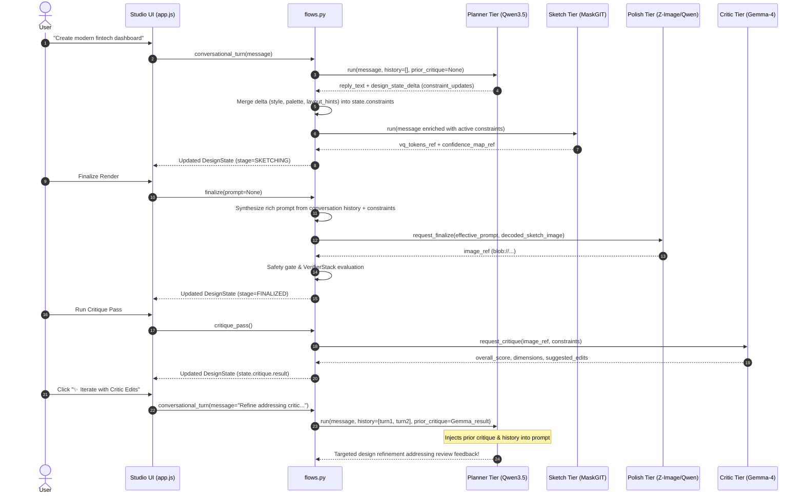

# Training ↔ Inference Synchronization & Agentic Architecture Design

This document details the verified synchronization contracts between **Krisna's Training Pipeline** and **Inference Orchestration Subsystem**, aligned with PRD §5.1 (Design State), §5.2 (Critique Adapter), §5.3 (Sequence Flows), §6.1 (Model Tiers), and §7.4 (Residency State Machine).

---

## 1. Model Tier Synchronization & Weight Contracts (PRD §6.1)

Every tier in Krisna follows an explicit training-to-serving contract. Precision, checkpoint serialization, and vocabulary geometries match by construction:

```
[Training Pipeline]                                           [Inference Subsystem]
krisna_training.sketch.train ──(checkpoint.pt: 768-dim)──────> MaskGITSketchModel (from_checkpoint)
krisna_training.polish.train_dpo ──(diffusers LoRA: BF16)───> ZImageTurboBackend (load_lora_weights)
data-forge UICrit corpus ──────(uicrit_critiques.jsonl)──────> PlannerBackend (UICritRAGIndex)
Frozen upstream weights ────────(Qwen-Image-Edit-2511)────────> QwenImageEditBackend (NF4 + CPU offload)
Frozen upstream weights ────────(Gemma 4 31B Dense)──────────> CriticWorker (NF4 subprocess IPC)
```

| Tier | PRD Model | Training Status | Weight & Serialization Contract | Inference Backend |
|---|---|---|---|---|
| **Planner** | Qwen3.5-9B (Fast: 4B) | **Frozen** (RAG-only) | No fine-tuning (Gated DeltaNet / Attention sensitivity under QLoRA). Grounded via retrieval over data-forge UICrit human critique corpus. | `PlannerBackend`: NF4 quantized (6.5GB VRAM), always-resident. |
| **Sketch** | MaskGIT Transformer | **Trained from scratch** | Multi-round bidirectional transformer over VQ-VAE tokens. Vocab size: `16,384`, Stage 1: `16x16` (256px), Stage 2: `32x32` (512px). Conditioning: CLIP ViT-L/14 text embeddings (`prompt_dim=768`). | `SketchBackend` & `MaskGITSketchModel`: checkpoint-pluggable, always-resident (3.0GB VRAM). |
| **Polish Default** | Z-Image-Turbo | **Trained (LoRA + DPO)** | Base model: `Tongyi-MAI/Z-Image` (undistilled base, BF16). Trained via `train_dpo.py` with logit-normal diffusion timestep sampling. | `ZImageTurboBackend`: Loads LoRA adapter directly on Z-Image-Turbo base (8.0GB VRAM). |
| **Polish Quality** | Qwen-Image-Edit-2511 | **Frozen** | SDEdit / instruction-guided latent image transformation. | `QwenImageEditBackend`: NF4 quantization (16.0GB VRAM / 10.0GB low-VRAM CPU offload). |
| **Critic** | Gemma 4 31B Dense | **Frozen** | Zero-shot multi-dimensional design evaluator. Outputs structured JSON critique schema. | `CriticWorker` & `CritiqueBackend`: Subprocess IPC, NF4 (18.0GB VRAM / 11.5GB VRAM + 45GB RAM offload). |

---

## 2. Design State & Structured Schemas (PRD §5.1, §5.2)

All model tiers communicate via the centralized `DesignState` object managed by `DesignStateStore` with optimistic concurrency (`revision` counter guard).

### A. Constraints Schema (PRD §5.1)
```python
class Constraints(BaseModel):
    style: str | None = None
    palette: list[str] = Field(default_factory=list)  # Hex color codes
    layout_hints: str | None = None
    locked_regions: list[LockedRegion] = Field(default_factory=list)
```

### B. Critique Result Schema (PRD §5.2)
```python
class CritiqueDimensionScore(BaseModel):
    score: float
    note: str = Field(default="", max_length=280)

class CritiqueResult(BaseModel):
    critique_source: str
    overall_score: float
    dimensions: dict[str, CritiqueDimensionScore]
    suggested_edits: list[dict[str, Any]]  # [{"region": str | list, "instruction": str}]
    raw_model_output_ref: str | None = None
```

---

## 3. Sequence Flows & Context Propagation (PRD §5.3)



### Key Synchronization Mechanics:

1. **Multi-Turn Context Forwarding**:
   - `flows.conversational_turn` snapshots `conversation_history` before appending the current turn, forwarding prior turns to `orchestrator.run_conversational_turn`.
   - `PlannerBackend` injects up to the last 6 turns into Qwen's chat template (`role="user"` and `role="assistant"`).
   - `cli.py` (`krisna-session`) also accumulates turns in loop execution.

2. **Planner JSON Delta Constraint Merging**:
   - Planner produces a trailing JSON object:
     `{"stage": "sketching", "constraint_updates": {"style": "...", "palette": [...], "layout_hints": "..."}, "tool_call": null, "reasoning_note": "..."}`
   - `flows.conversational_turn` parses this delta and directly updates `state.constraints.style`, `state.constraints.palette`, `state.constraints.layout_hints`, and `state.constraints.locked_regions`.

3. **Critic Feedback Loop Closure**:
   - When critique completes, `state.critique.result` holds the structured critique.
   - Subsequent calls to `conversational_turn` pass `prior_critique` to `PlannerBackend.run`.
   - `PlannerBackend._build_system_prompt` formats overall score, dimension notes, and itemized suggested edits into the system prompt.

4. **Sketch Prompt Grounding**:
   - `SketchBackend.run` enriches prompt text using active constraints (`message (style; palette; layout)`), grounding the CLIP ViT-L/14 text embedder in design state rather than bare keyword input.

5. **Finalize Prompt Synthesis**:
   - If `prompt` is None, `flows.finalize` synthesizes an enriched prompt from conversation history and active constraints, passing it to both the Polish renderer and the Verifier Stack.

---

## 4. VRAM Envelopes & State Machine (PRD §7.4)

Baseline residency maintains **Planner (NF4: 6.5GB)** + **Sketch (BF16: 3.0GB)** = **9.5GB VRAM**, well under the 10GB resident ceiling:

- **Conversational Turn**: Zero swaps. High throughput.
- **Finalize**: Planner + Sketch unloaded; Polish tier loaded (`POLISH_DEFAULT` 8GB / `POLISH_QUALITY` 16GB). Output generated, verifiers scored, baseline restored.
- **Critique**: Polish unloaded; Critic loaded (`CRITIC` 18GB). Critique generated, baseline restored.
- **Low-VRAM Envelope**: 12–16GB target via diffusers model CPU-offload (Polish Quality) and bitsandbytes CPU-offload (Critic with 45GB host RAM).
