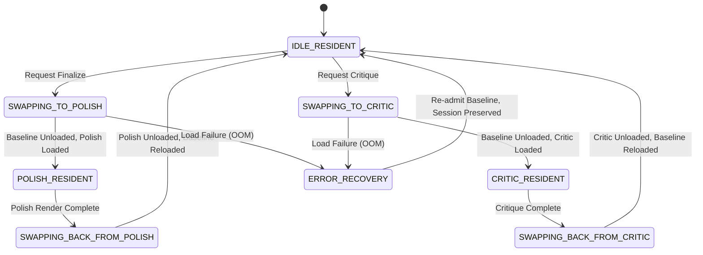

# Krisna Inference & Serving Architecture

Comprehensive reference for single-GPU serving, swap orchestration, and multi-turn agentic flows.

> [!IMPORTANT]
> **Canonical Specification**: Defined in [docs/PRD.md §5](file:///d:/Krisna/docs/PRD.md#5-data-model--core-flows) (Data Model & Core Flows) and [docs/PRD.md §7](file:///d:/Krisna/docs/PRD.md#7-inference-orchestration) (Inference Orchestration).
> Krisna is a **swap orchestrator** that never keeps more than one large generative tier GPU-resident at a time.

---

## 1. System Pipeline Architecture

```
User Intent (Chat Turn)
       │
       ▼
┌────────────────────────────────────────────────────────┐
│ Tier A: Baseline (Always Resident, ~9.5GB VRAM)        │
│  - Planner Backend (Qwen3.5-9B, NF4, RAG-grounded)     │
│  - Sketch Backend (MaskGIT Transformer, 512px)         │
└────────────────────────────────────────────────────────┘
       │                                  │
       ▼ (User requests Finalize)         ▼ (User requests Critique)
┌────────────────────────────────┐  ┌────────────────────────────────┐
│ Tier B: Polish Tier (Swapped)  │  │ Tier C: Critic Tier (Swapped)  │
│  - Polish-Default (Z-Image)    │  │  - Gemma 4 31B Dense (NF4)     │
│  - or Polish-Quality (Qwen)    │  │  - Zero-shot VLM-as-a-judge    │
│  - Verifier Stack Gate         │  │  - Multi-axis Critique Output  │
└────────────────────────────────┘  └────────────────────────────────┘
       │                                  │
       └─────────────────┬────────────────┘
                         ▼
        Orchestrator unloads swappable tier,
        reloads Tier A baseline, returns to IDLE.
```

---

## 2. Residency State Machine (PRD §7.4)

Verified transition table implemented in `krisna_inference.orchestrator.state_machine`:



---

## 3. Resource Ledgers & Envelopes (PRD §3, §7.2, §7.3)

Admission is deterministic and CI-testable, governed by `VRAMLedger` and `RAMLedger` against declared budgets:

| Tier | Full Envelope (24GB Target) | Low-VRAM Envelope (12GB Target) | Offload Mechanism |
|---|---|---|---|
| **Planner** (Always Resident) | 6.5 GB VRAM / 0 GB RAM | 6.5 GB VRAM / 0 GB RAM | BitsAndBytes NF4 |
| **Sketch** (Always Resident) | 3.0 GB VRAM / 0 GB RAM | 3.0 GB VRAM / 0 GB RAM | PyTorch BF16 / FP32 |
| **Polish-Default** (Z-Image-Turbo) | 14.0 GB VRAM / 0 GB RAM | 12.0 GB VRAM / 2.0 GB RAM | `enable_model_cpu_offload()` |
| **Polish-Quality** (Qwen-Image-Edit) | 16.0 GB VRAM / 0 GB RAM | 10.0 GB VRAM / 10.0 GB RAM | `enable_model_cpu_offload()` |
| **Critic** (Gemma 4 31B) | 18.0 GB VRAM / 0 GB RAM | 11.5 GB VRAM / 45.0 GB RAM | Transformers + bnb FP32 offload |

---

## 4. Multi-Turn Agentic Feedback Loop

1. **Context Preservation**:
   - Every `POST /session/{id}/message` carries cumulative `conversation_history` into the Planner backend.
2. **Dynamic Constraints Merging**:
   - Structured JSON output appended by Planner is parsed and stripped from the user reply.
   - `constraint_updates` (theme, palette, devices, and `locked_regions: [{bbox, reason}]`) are merged into `DesignState.constraints`.
3. **Conditioned Generation & Prompt Synthesis**:
   - Sketch generation tokens (`vq_tokens`) ground CLIP text embeddings in active constraints.
   - Finalize synthesizes a complete, detailed prompt from active constraints when none is explicitly supplied.
4. **Closed Critic Feedback**:
   - Critic passes return structured `suggested_edits` with bounding boxes.
   - The Web Studio UI provides a 1-click **"✨ Iterate with Critic Edits"** button feeding structured feedback directly into the next Planner turn.

---

## 5. REST API Endpoints

FastAPI service exposed on default port `8420`:

| Method | Route | Description |
|---|---|---|
| `POST` | `/session` | Initializes a new `DesignState` session. |
| `GET` | `/session/{id}` | Retrieves active `DesignState` snapshot. |
| `POST` | `/session/{id}/message` | Advances conversational turn (Planner + Sketch pass). |
| `POST` | `/session/{id}/finalize` | Initiates tier swap, decodes VQ tokens, runs Polish, scores verifiers. |
| `POST` | `/session/{id}/critique` | Initiates tier swap to Gemma 4, evaluates design, returns structured feedback. |
| `GET` | `/session/{id}/render` | Streams raw finalized image bytes (`image/png`). |
| `GET` | `/orchestrator/status` | Reports residency state, declared ledgers, and live hardware probes. |

---

## 6. Related Documentation

- **[inference/README.md](file:///d:/Krisna/inference/README.md)**: Serving setup, mock vs real backends, and low-VRAM flags.
- **[inference/frontend/README.md](file:///d:/Krisna/inference/frontend/README.md)**: Node.js Web Studio & Canvas2D Generalization Visualizer.
- **[inference/runtime/README.md](file:///d:/Krisna/inference/runtime/README.md)**: CLI harness for multi-turn manual testing.

