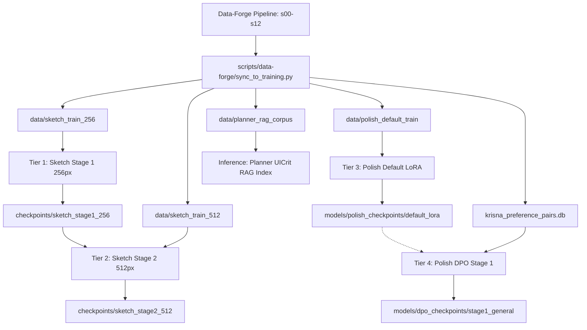

# Krisna Training Runbook

**Target Platform**: Intel Core i9 | NVIDIA RTX A6000 (48GB VRAM) | 128GB RAM | Windows 11 / Server  
**Canonical Reference**: PRD §6 (Status: Final, no-RLHF revision)  
**Execution Shells**: PowerShell (`.\scripts\training\train_all.ps1`) or Git Bash (`./train.sh`)

---

## 1. System Architecture & Model Stack

The Krisna training layer trains the generative models that produce UI designs from user prompts. Per PRD §6, the pipeline operates with **no AI-judge training signals** and keeps Planner and Critic frozen at inference.



### Active vs Frozen Model Tiers

| Tier | Status | Architecture & Base | Training Data | Hardware Profile (A6000 48GB) |
|---|---|---|---|---|
| **sketch-stage1** | **ACTIVE** | MaskGIT transformer (256px, 16x16 grid) | `data/sketch_train_256/manifest.jsonl` | Batch=32, lr=3e-4, num_workers=8, ~14GB VRAM |
| **sketch-stage2** | **ACTIVE** | MaskGIT transformer (512px, 32x32 grid, continued via `init_from`) | `data/sketch_train_512/manifest.jsonl` | Batch=16, lr=1.5e-4, num_workers=6, grad_ckpt=true, ~28GB VRAM |
| **polish-default** | **ACTIVE** | Z-Image-Turbo DreamBooth LoRA (rank=32, alpha=32) | `data/polish_default_train/` | Diffusers script, 1024px, bf16, ~24GB VRAM |
| **polish-dpo** | **ACTIVE** | Flow-matching Diffusion-DPO (beta=2000) | `krisna_preference_pairs.db` | Ref-model CPU-offloaded, batch=1, grad_accum=4, 512px, ~38GB VRAM |
| **planner** | *DEPRECATED* | Qwen3.5-9B (Frozen) | None (UICrit RAG at inference) | Frozen; zero-shot in-context learning |
| **critic** | *DEPRECATED* | Gemma 4 31B Dense (Frozen) | None (Frozen zero-shot) | Frozen; zero-shot scoring |

---

## 2. Environment Preparation

### Step 2.1: Automated Setup via PowerShell / Shell Scripts

Automated setup scripts are provided for both standard training dependencies and Polish tier diffusers requirements:

```powershell
# Windows (PowerShell):
.\scripts\training\setup_env_training.ps1             # Core training environment & editable install
.\scripts\training\setup_env_diffusers_training.ps1   # Diffusers repo & Dreambooth requirements
.\scripts\training\download_vqgan.ps1                 # Downloads VQGAN codebook to checkpoints/vqgan/
```

Or on Linux / Git Bash:
```bash
./scripts/training/setup_env_training.sh
./scripts/training/setup_env_diffusers_training.sh
./scripts/training/download_vqgan.sh
```

### Step 2.2: Manual Python Virtual Environment & Dependencies (Alternative)

From the repository root (`D:\Krisna`):

```powershell
# Create virtual environment if not present
python -m venv .venv

# Activate environment
.\.venv\Scripts\Activate.ps1

# Upgrade pip & packaging tools
python -m pip install --upgrade pip setuptools wheel

# Install PyTorch with CUDA 12.4/12.6 support
pip install torch torchvision --index-url https://download.pytorch.org/whl/cu124

# Install Krisna training and inference packages in editable mode
pip install -e training/
pip install -e inference/
pip install -e data-forge/

# Install diffusers & Dreambooth requirements for Polish Tier
pip install accelerate peft transformers diffusers[torch] pyyaml
```

### Step 2.3: Accelerate Configuration

Run non-interactive Accelerate configuration for single-GPU A6000:

```powershell
accelerate config default --mixed_precision bf16
```

Verify VQGAN files exist:
- `checkpoints/vqgan/last.ckpt` (~3.8 GB)
- `checkpoints/vqgan/model.yaml`

---

## 3. Data-Forge Pipeline & Bridge Synchronization

### Step 3.1: Generate Processed Datasets

Run the Data-Forge pipeline stages to completion (s00 through s12):

```powershell
.\run_data_forge.ps1 run
```

This generates exports in `DATA_ROOT` (default `D:\data_krisna`):
- `model_data/sketch_tier_maskgit/images/` + `captions.jsonl`
- `model_data/polish_zimage_turbo/images/` + `captions.jsonl`
- `preference_pairs/` (human preference pairs from Pick-a-Pic v2 & HPD v2)
- `model_data/planner_rag_corpus/uicrit_critiques.jsonl`

### Step 3.2: Synchronize into Training Datasets

Execute the unified bridge sync:

```powershell
python scripts/data-forge/sync_to_training.py --data-root "D:\data_krisna"
```

To verify dataset readiness without modifying files:
```powershell
python scripts/data-forge/sync_to_training.py --data-root "D:\data_krisna" --check-only
```

Expected outputs produced in `./data/`:
1. `data/sketch_train_256/manifest.jsonl` + `tokens/*.npy` (256px MaskGIT tokens)
2. `data/sketch_train_512/manifest.jsonl` + `tokens/*.npy` (512px MaskGIT tokens)
3. `data/polish_default_train/` (scrubbed images + `metadata.jsonl`)
4. `krisna_preference_pairs.db` + `krisna_blobs/` (SQLite table with parsed Pick-a-Pic & HPD pairs)
5. `data/planner_rag_corpus/uicrit_critiques.jsonl` (Human UICrit critique text)

---

## 4. Launching Model Training

### Option A: Sequential Execution of All 4 Tiers (Recommended)

To run the complete pipeline end-to-end with automated pre-flight checks and hardware monitoring:

```powershell
# Dry run first to verify environment and datasets:
.\scripts\training\train_all.ps1 -All -DryRun

# Live execution:
.\scripts\training\train_all.ps1 -All
```

To auto-sync from `DATA_ROOT` before training:
```powershell
.\scripts\training\train_all.ps1 -Sync -DataRoot "D:\data_krisna" -All
```

### Option B: Tier-by-Tier Manual Execution

#### Tier 1: Sketch Stage 1 (256px MaskGIT from scratch)
```powershell
.\scripts\training\train_all.ps1 -Tier sketch-stage1
```
- **Canonical Config**: `training/configs/sketch_stage1_256.yaml` (legacy: `sketch_train_stage1_256.yaml`)
- **Steps**: 40,000 steps
- **Artifact**: `checkpoints/sketch_stage1_256/checkpoint_final.pt`

#### Tier 2: Sketch Stage 2 (512px progressive continuation)
```powershell
.\scripts\training\train_all.ps1 -Tier sketch-stage2
```
- **Canonical Config**: `training/configs/sketch_stage2_512.yaml` (legacy: `sketch_train_stage2_512.yaml`)
- **Prerequisite**: Verifies `checkpoints/sketch_stage1_256/checkpoint_final.pt` exists and interpolates 16x16 positional embeddings to 32x32.
- **Steps**: 60,000 steps
- **Artifact**: `checkpoints/sketch_stage2_512/checkpoint_final.pt`

#### Tier 3: Polish Default LoRA (Z-Image-Turbo Base Fine-Tuning)
```powershell
.\scripts\training\train_all.ps1 -Tier polish-default
```
- **Canonical Config**: `training/configs/polish_stage1_default_lora.yaml` (legacy: `polish_default_lora_z_image.yaml`)
- **Steps**: 1,500 steps
- **Artifact**: `models/polish_checkpoints/default_lora/pytorch_lora_weights.safetensors`

#### Tier 4: Polish Diffusion-DPO Stage 1 (General Human Preference)
```powershell
.\scripts\training\train_all.ps1 -Tier polish-dpo
```
- **Canonical Config**: `training/configs/polish_stage2_dpo_general.yaml` (legacy: `dpo_z_image_stage1_general.yaml`)
- **Steps**: 1,000 steps
- **Artifact**: `models/dpo_checkpoints/stage1_general/final/`

---

## 5. Hyperparameter Tuning & Research Guidance

### Sketch Tier (MaskGIT)
- **Sequence Length**: 256 tokens at 256px, 1024 tokens at 512px.
- **Gradient Checkpointing**: Kept `false` in Stage 1 (attention fits easily in 48GB); set to `true` in Stage 2 to prevent peak activation OOM at 1024 tokens.
- **Caption Mixing**: `caption_mix_ratio: 0.95` exposes the model to 5% short/human captions (Betker et al. 2023), preventing failure when user prompts are short.
- **CFG Dropout**: `cfg_dropout_prob: 0.1` enables classifier-free guidance at inference time.

### Polish Tier (Z-Image-Turbo Diffusion-DPO)
- **Beta Parameter Sweep**: The baseline default is `beta: 2000.0`. In flow-matching models with velocity prediction (like Z-Image-Turbo), the loss scale differs from epsilon-prediction diffusion. Candidate sweep values:
  - `beta: 2000.0` (baseline)
  - `beta: 1000.0` (moderate regularization)
  - `beta: 500.0` (tight anchor to reference model if visual artifacts or over-saturation appear)
- **Stage 2 UI-Domain DPO Recipe**: Once human UI preference pairs (DesignSense-10k / DesignPref) are available:
  1. Create `training/configs/dpo_z_image_stage2_domain.yaml`
  2. Set `lora-adapter-path: "models/dpo_checkpoints/stage1_general"`
  3. Set `output-dir: "models/dpo_checkpoints/stage2_domain"`
  4. Set `source: ["designsense_10k", "designpref"]`
  5. Run: `.\scripts\training\train_all.ps1 -Tier polish-dpo -Config training/configs/dpo_z_image_stage2_domain.yaml`

---

## 6. Checkpoint Verification & Inference Wiring

### Step 6.1: Verify Trained Checkpoints

Ensure the output artifacts exist and have expected non-zero sizes:
```powershell
Get-ChildItem -Path checkpoints\sketch_stage1_256\checkpoint_final.pt
Get-ChildItem -Path checkpoints\sketch_stage2_512\checkpoint_final.pt
Get-ChildItem -Path models\dpo_checkpoints\stage1_general\
Get-ChildItem -Path data\planner_rag_corpus\uicrit_critiques.jsonl
```

### Step 6.2: Wire Checkpoints to Live Inference

Update your repository root `.env` file or export environment variables:

```env
# Sketch Tier Checkpoint (512px progressive model)
KRISNA_SKETCH_CHECKPOINT=checkpoints/sketch_stage2_512/checkpoint_final.pt

# Polish Tier LoRA Adapter (Fine-tuned + DPO aligned)
KRISNA_POLISH_DEFAULT_LORA_PATH=models/dpo_checkpoints/stage1_general

# Planner UICrit RAG Corpus Directory
KRISNA_DATA_DIR=data
```

### Step 6.3: Validate Full Inference Pipeline

Test that inference backend auto-discovers and loads all active checkpoints:

```powershell
python -m krisna_inference.orchestrator.cli --dry-run
```
